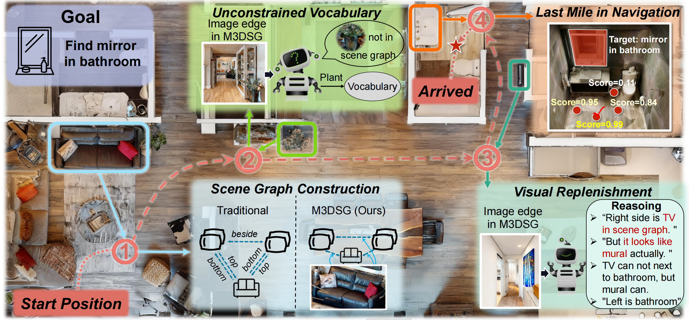
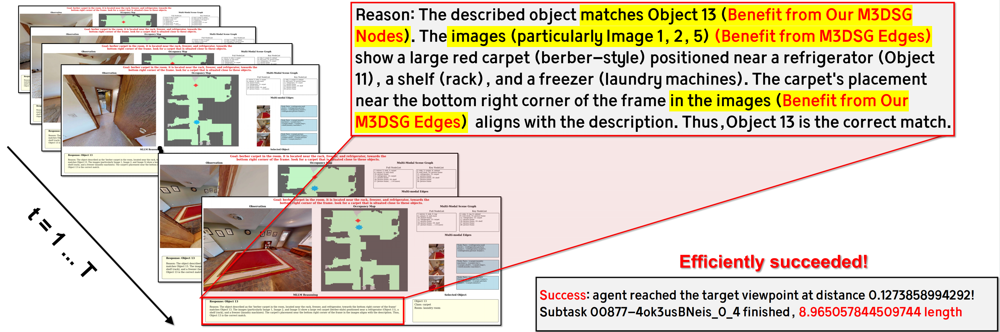
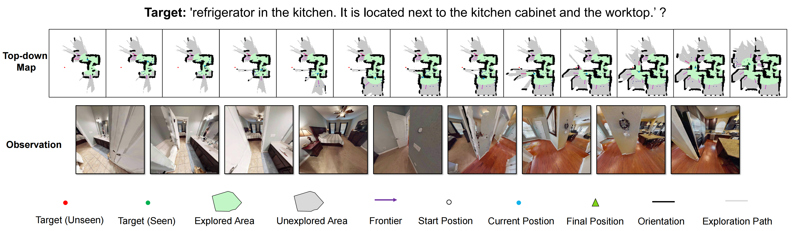

# MSGNav: Unleashing the Power of Multi-modal 3D Scene Graph for Zero-Shot Embodied Navigation

<p align="center">
  <a href="https://arxiv.org/abs/2511.10376"><b>CVPR 2026</b></a>
</p>

<div align="center">
  
</div>


## 📰 News
- [Mar 23, 2026] 🔄 Codebase updated.
- [Coming Soon] 🤖 Real-world deployment code for Unitree-G1 will be released.
- [Mar 16, 2026] The bug on HM3D evaluation has been fixed, and now you can test it on both GoatBench and HM3D benchmarks
- [Mar 13, 2026] Note: There are some issues with the evaluation code on HM3D, which are currently being fixed. Please try GoatBench first
- [Mar 4, 2026] 🚀 Code is released.
- [Feb 21, 2026] 🎉 MSGNav is accepted to CVPR 2026.

## Installation

```bash
- conda create -n msgnav python=3.9 -y && conda activate msgnav
- pip install torch==2.0.1 torchvision==0.15.2 --index-url https://download.pytorch.org/whl/cu118
# or: pip install torch==2.0.1 torchvision==0.15.2 --trusted-host http://pypi.tuna.tsinghua.edu.cn
- conda install -c conda-forge -c aihabitat habitat-sim=0.2.5 headless faiss-cpu=1.7.4 -y
- conda install https://anaconda.org/pytorch3d/pytorch3d/0.7.4/download/linux-64/pytorch3d-0.7.4-py39_cu118_pyt201.tar.bz2 -y
- pip install omegaconf==2.3.0 open-clip-torch==2.26.1 ultralytics==8.2.31 supervision==0.21.0 opencv-python-headless==4.10.0.84 scikit-learn==1.4 scikit-image==0.22 open3d==0.18.0 hipart==1.0.4 openai==1.35.3 httpx==0.27.2 numpy==1.24.3 scipy==1.11.4 ollama
- pip install git+https://github.com/ultralytics/CLIP.git
```

## 1 - Preparations

### 1) Dataset

Step1: Please download the val split of [HM3D_v0.2](https://github.com/matterport/habitat-matterport-3dresearch)


For example, if your download path is `/your_path/hm3d/` and it contains: `/your_path/scene_datasets/hm3d/val/`

Then you can set `scene_data_path` in the config files:

- `cfg/eval_goatbench.yaml`
- `cfg/eval_hm3d.yaml`

Step2: Please also prepare evaluation episodes and set `test_data_dir`:

- GOAT-Bench episodes:
  - Download reference: [GOAT-Bench](https://github.com/Ram81/goat-bench)

- HM3D-ObjNav challenge episodes:
  - Download reference: [HM3D (data/datasets/objectnav/hm3d/v2/)](https://github.com/facebookresearch/habitat-lab/blob/main/DATASETS.md)

- After download/unzip, set `test_data_dir` in the config files.

### 2) OpenAI API Setup

Please set up the endpoint and API key in `src/const.py`:

```python
Qwen_END_POINT = "https://dashscope.aliyuncs.com/compatible-mode/v1"
Qwen_OPENAI_KEY = "YOUR_QWEN_API_KEY"

GPT_END_POINT = "YOUR_GPT_ENDPOINT"
GPT_OPENAI_KEY = "YOUR_GPT_API_KEY"
```

Model selection is controlled by the `model` parameter in `src/explore_utils.py`:

```python
def call_openai_api(sys_prompt, contents, model='qwen'):
    ...
```

- Use Qwen: keep `model='qwen'` (default), or call `call_openai_api(..., model='qwen')`.
- Use GPT: call `call_openai_api(..., model='gpt')`.

## 2 - Run Evaluation

### 1) HM3D single process

Default (run all scenes/episodes):

```bash
python run_hm3d_evaluation.py -cf cfg/eval_hm3d.yaml
```

Run a ratio subset:

```bash
python run_hm3d_evaluation.py -cf cfg/eval_hm3d.yaml --start_ratio 0.0 --end_ratio 0.5
```

### 2) GOAT-Bench single process

Default (run all scenes in the default split):

```bash
python run_goatbench_evaluation.py -cf cfg/eval_goatbench.yaml
```
Run split and ratio:

```bash
python run_goatbench_evaluation.py -cf cfg/eval_goatbench.yaml --split 1 --start_ratio 0.0 --end_ratio 0.5
```

### 3) Parallel execution: `start_multiprocess.py`

Use this script to run scene tasks in parallel across multiple GPUs (supports both HM3D and GOAT-Bench):

```bash
python start_multiprocess.py --task <hm3d|goatbench> --devices 0,1,2,3 --total_scenes 36 --splits 1
```

Common examples:

```bash
# Run the first episode of each scene in the 36 scenes of HM3D in parallel using 4 gpus
python start_multiprocess.py --task hm3d --devices 0,1,2,3 --total_scenes 36 --splits 1


# Run the first episode of each scene in the 18 scenes (36 * 0.5) of Goatbench in parallel using 2 gpus
python start_multiprocess.py --task goatbench --devices 0,1 --total_scenes 36 --splits 1 --start_ratio 0.0 --end_ratio 0.5
```

Key arguments:

- `--task`: `hm3d` or `goatbench`
- `--devices`: comma-separated GPU ids, e.g. `0,1,2,3`
- `--total_scenes`: number of scene tasks per split (default: `36`)
- `--splits`: number of splits (default: `1`)
- `--start_ratio`, `--end_ratio`: optional ratio range passed to task start scripts


## 3 - Visualization

You can control visualization saving by setting `save_visualization` in `yaml` (This will result in slower inference). 

When visualization is enabled, the evaluation pipeline saves:

- Frontier images (frontier candidates and VLM choice visualization)
- Top-down map snapshots for each step
- Scene graph related visual outputs

Visualization examples (`save_visualization: true`):

<div align="center">
  
</div>

<div align="center">
  
</div>

## Acknowledgement

The codebase is built upon [3D-Mem](https://github.com/UMass-Embodied-AGI/3D-Mem) and [Concept-Graph](https://github.com/concept-graphs/concept-graphs). We thank the authors for their great work.

## Citation

If you find our work helpful, please cite:

```bibtex
@article{MSGNav,
  title={MSGNav: Unleashing the Power of Multi-modal 3D Scene Graph for Zero-Shot Embodied Navigation},
  author={Huang, Xun and Zhao, Shijia and Wang, Yunxiang and Lu, Xin and Zhang, Wanfa and Qu, Rongsheng and Li, Weixin and Wang, Yunhong and Wen, Chenglu},
  journal={arXiv preprint arXiv:2511.10376},
  year={2025}
}
```
